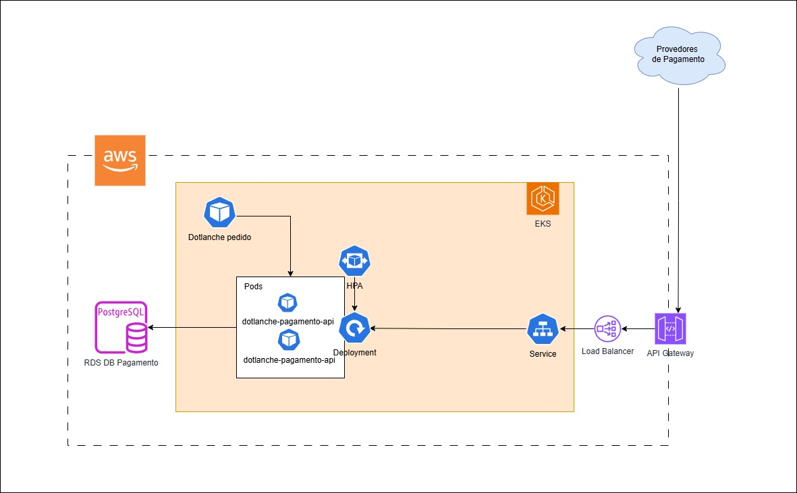

# 💸 Dotlanches Pagamento

[](https://sonarcloud.io/summary/new_code?id=98Lanches_dotlanche-pagamento)

Microsserviço de pagamentos Dotlanches. Responsável pelo controle de pagamentos dos pedidos e pela integração com provedores de pagamento.

# Funcionalidades
- Criação de registro de pagamento para um pedido.
- Confirmação de pagamento de pedido via QR Code (web hook).
- Consulta de situação de pagamento de pedido.

Provedores de pagamento disponíveis:
- QR Code: Fake Checkout. Serviço que simula geração de QR Code.

# Stack
- .NET 8.0
- EntityFramework
- Postgresql
- NUnit
- Moq
- Reqnroll
- Docker
- Docker Compose
- Kubernetes
- GitHub Actions

# Arquitetura do Sistema
O serviço foi construído utilizando arquitetura hexagonal para organização interna. O banco de dados selecionado foi o Postgresql pela proximidade do time com esta ferramenta.

# Arquitetura Solução


# Como executar o projeto

## Pré-requisitos
- Docker

1. Na raiz do projeto, execute o comando
```
docker compose up
```
2. Acesse o navegador o endereço http://localhost:8080/swagger/index.html

# Testes
Tanto os testes de unidade quanto os testes de BDD encontram-se no diretório `test`.

Para executar os testes da aplicação, basta rodar o comando abaixo na raiz do projeto:
```
dotnet test
```
